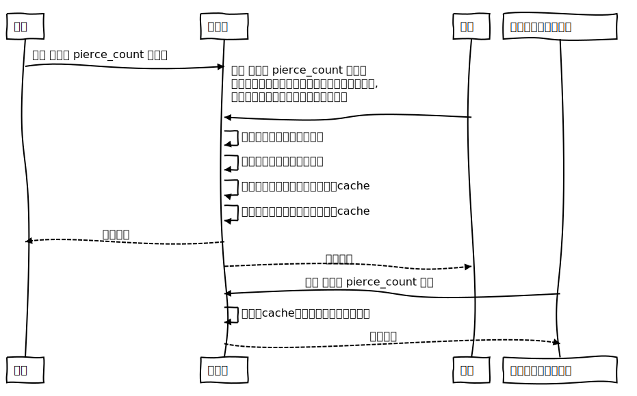

### 实验 （缓存，缓存穿透）
---
### 目录
- [缓存](#缓存)
  - [代码](#代码)
  - [问题](#问题)
  - [代码改进](#代码改进)
  - [结果](#结果)
    - [缺点](#缺点)
- [缓存穿透](#缓存穿透)
    - [代码](#代码c)
    - [时间图](#时间图)
    - [实验](#实验)
      - [结果.](#结果如下)
    - [解决](#解决)
    
---
#### 缓存
> 简单在数据上分析，可以减少数据库压力，毕竟常规的查找数据库需要连接数据库把数据从磁盘中取出，而现在的redis，memcache 等都是把缓存存到内存中，减少数据库的开销。


##### **代码**
``` php
<?php
    //一个简单的统计表数据条目总数
	try {
	    $pdo = new PDO("mysql:host=127.0.0.1;dbname=test", "root", "111111");
	} catch (PDOException $e) {
	    echo 'Connection failed: ' . $e->getMessage();
	}
	
	$pdo->query('set names utf8;');
	$res = $pdo->query("select count(1) as count from pierce")->fetchAll(PDO::FETCH_CLASS )[0];
	print_r($res -> count);
```
##### **问题**
在访问量大的情况下，这些统计查询会造成数据库查询压力，一般会把统计的信息放到缓存中，然后按照特定的时间去更新，就像起点的最新文章更新，博客的我的文章旁边的统计数目一样，都是隔断时间才重新到数据库查询统计的，在等待更新的时间中，从缓存中去取，去除了查询数据库的步骤。

##### **代码改进**
``` php
<?php
	$redis = new Redis();
	$redis->connect('127.0.0.1', 6379);
	$redis->auth('jimb55');
	
	if($redis -> exists("pierce_count")){
	    $count =     $redis -> get("pierce_count");
	    $type = "cache";
	}else{
	
	    try {
	        $pdo = new PDO("mysql:host=127.0.0.1;dbname=test", "root", "111111");
	    } catch (PDOException $e) {
	        echo 'Connection failed: ' . $e->getMessage();
	    }
	
	    $pdo->query('set names utf8;');
	    $res = $pdo->query("select count(1) as count from pierce")->fetchAll(PDO::FETCH_CLASS )[0];
	
	    $count = $res -> count;
	    $redis -> setex("pierce_count",10,$count);
	    $type = "db";
	}
	
	echo "总数：$count($type)";	
```

##### **结果**
第一次在数据库中取出 总数，输出 **总数：18(db)**，在接下来的**10**秒中再次查询第二次，输出**总数：18(cache)**，我这里**10秒**有**100万访问**(这句话前面加个假如),那么当第一人访问后count值被储存到redis，后面的100万减1人都会从redis 中取出这个key值，就是数据库压力减少了100万减1次。

##### **缺点**
但这里有个缺点，如果我在十秒钟有新条目添加呢？就是我table中加了条数据，就本应输出 **总数：19(db)**的，但是因为cache 中 10秒未过期，导致输出 **总数：18(cache)**，这里就需要按照实际情况考虑了，有些数据是不需要实时更新的，可以直接无视，有些更新不频繁的若真要做到实时更新又使用缓存，可以在数据库 的insert 或 update 步骤中 delete redis 的pierce_count值

---
#### 缓存穿透
> 上面的代码其实存在一个隐患，那就是**缓存穿透**，简单点就是在我们更新缓存时，会去查找数据库，但这个查找却是需要时间的，可能一秒，可能两秒，甚至更多，但隐患来了，假如我查找数据库的这段时间中，有100万人访问，那我岂不是要查找一百万次数据库？毕竟要查找数据库成功了，才会把数据记录到缓存，但这个成功是需要时间的。

##### **代码c**
``` php
<?php
	// 一百万人 同时访问开始了
	$redis = new Redis();
	$redis->connect('127.0.0.1', 6379);
	$redis->auth('jimb55');
	
	// <step 1>一百万人中的第一个人开始访问
	// <step 4>一百万人中的第二人开始访问，但发现 pierce_count 不存在，第一个人搞什么鬼？
	// <step 7>一百万人中的第三人，第四人，第五人...开始访问，但发现 pierce_count 不存在，第一个人搞什么鬼？
	if($redis -> exists("pierce_count")){
	    $count =     $redis -> get("pierce_count");
	    $type = "cache";
	}else{
	    // <step 2>一百万人中第一个人 --> 转入此流程
	    // <step 5>一百万人中的第二人 --> 转入此流程
	    // <step 8>一百万人中的第三人，第四人，第五人... --> 转入此流程
	    try {
	        $pdo = new PDO("mysql:host=127.0.0.1;dbname=test", "root", "111111");
	    } catch (PDOException $e) {
	        echo 'Connection failed: ' . $e->getMessage();
	    }
	
	    $pdo->query('set names utf8;');
	    $res = $pdo->query("select count(1) as count from pierce")->fetchAll(PDO::FETCH_CLASS )[0];
	    // 模拟上面这条查询需要一秒
	    sleep(1);
	    // <step 3>一百万人中第一个人在这里等待一秒
	    // <step 6>一百万人中的第二人在这里等待一秒,查找数据库中....
	    // <step 9>一百万人中的第三人，第四人，第五人...在这里等待一秒,查找数据库中....
	
	    $count = $res -> count;
	    // 这句实际存储的pierce_count的值得句柄要的一百万人中第一个人查询数据得出结果才会执行
	    $redis -> setex("pierce_count",10,$count);
	    $type = "db";
	}
	
	
	echo "总数：$count($type)";
```

##### **时间图**



##### **实验**
先写个小工具模拟发送请求
``` shell
#!/bin/sh

echo "" > curl.res
int=4
for a in `seq $int`
do
    curl http://172.16.47.129/pierce.php >> curl.res && echo "" >> curl.res &
done
```
模拟发送4个并发,考虑到当前配置的php-fpm只开了4个子进程

##### **结果如下**
```
jimb55@ubuntu:~/local$ cat curl.res       

总数：18(db)
总数：18(db)
总数：18(db)
总数：18(db)
```
改为5个并发的结果
```
jimb55@ubuntu:~/local$ cat curl.res 

总数：18(db)
总数：18(db)
总数：18(db)
总数：18(cache)
总数：18(db)
```
##### **解决**
问题发现了，那么到底怎么才能**只访问一次数据库**，而其他次数都是访问cache呢？换而言之就是要得到如下结果
```
jimb55@ubuntu:~/local$ cat curl.res 

总数：18(db)
总数：18(cache)
总数：18(cache)
总数：18(cache)
总数：18(cache)
```
答案就是用**锁**，什么锁也好，只要能保证那段查找数据库的代码只允许一人通过就行。
```
// 一百万人 同时访问开始了
$redis = new Redis();
$redis->connect('127.0.0.1', 6379);
$redis->auth('jimb55');

// setNX 可作为 分布锁使用, 没有就存入且返回1，有就不存，返回0
$isExist = $redis->setNX("lock_pierce_count", 1);

if ($isExist) {
    echo "流程一";
    $redis -> expire("lock_pierce_count",5);
}else{
    echo "流程二";
}

```
再用脚本模拟发送请求，就算改成上百个，这些并发访问中，只有一个走**流程一**，其他的全部走**流程二**，再加上我原来的代码

```php 
 // 一百万人 同时访问开始了
$redis = new Redis();
$redis->connect('127.0.0.1', 6379);
$redis->auth('jimb55');

// 无限循环，只有在缓存或数据库中取到值才会跳出
while(true){
    // 在缓存判断是否存在统计只
    // 有就从缓存中取
    // 没有就从数据库中取
    if ($redis->exists("pierce_count")) {
        $count = $redis->get("pierce_count");
        $type = "cache";
        break;
    } else {
        // 防止多并发情况下的缓存穿透，只能允许一人通过
        $isExist = $redis->setNX("lock_pierce_count", 1);
        if ($isExist) {
            // 防止请求死掉，变成死锁
            // 若5秒后还不能完成访问数据库任务,便直接解锁
            $redis->expire("lock_pierce_count", 5);

            try {
                $pdo = new PDO("mysql:host=127.0.0.1;dbname=test", "root", "111111");
            } catch (PDOException $e) {
                echo 'Connection failed: ' . $e->getMessage();
            }

            $pdo->query('set names utf8;');
            $res = $pdo->query("select count(1) as count from pierce")->fetchAll(PDO::FETCH_CLASS)[0];
            sleep(1);

            $count = $res->count;
            $redis->setex("pierce_count", 1, $count);
            // 解锁
            $redis->del("lock_pierce_count");
            $type = "db";
            break;
        }else{
            // 同时并发的其他人只能处于等待一段时间再次访问流程
            usleep(100000);
            //...
            // 当然，期间还能做许多操作，如超时,从备份缓存中取等
            //...
            continue;
        }
    }
}
echo "总数：$count($type)";
```
