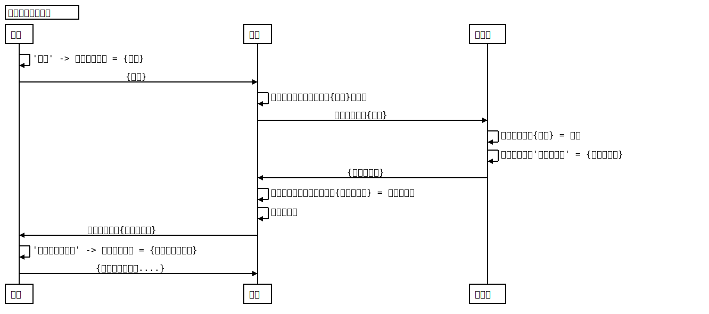
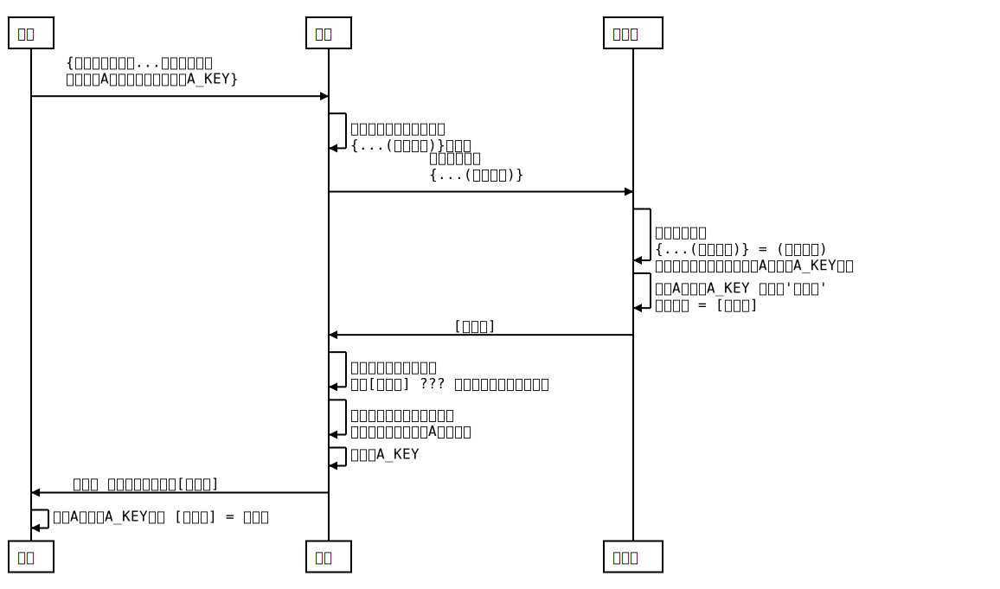
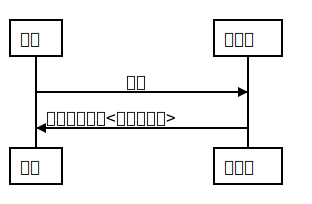
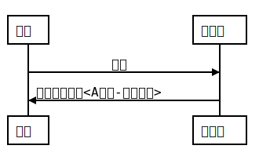
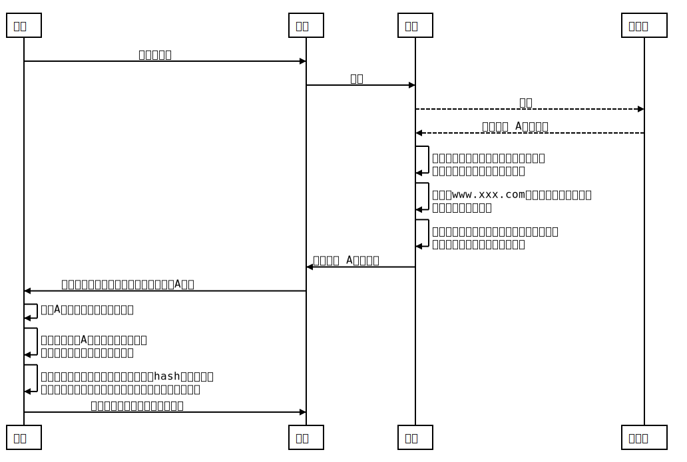

### 实验 （加密,HTTPS,SSL）
---
### 目录
- [加密](#加密)
  - [概念](#概念)
  - [时序图 与 引发问题](#时序图)
- [SSL](#SSL)
  - [作用](#SSL)
  - [时序图 与 引发问题](#时序图)
  - [过程](#过程)
- [nginx](#nginx)
  - [配置](#nginx)


---
#### 加密
> 黑客能从客户到服务数据传输之间进行数据窃取，加密的作用就是使其不能看到传输的真实内容

参看资料
ssl 加密，明文，签名 的文章 http://blog.csdn.net/u013424496/article/details/51161370
ssl 证书发布机构的证书 和 服务端的证书 生成 http://blog.csdn.net/mr_raptor/article/details/51854805
nginx 安装证书 	 http://www.linuxidc.com/Linux/2013-08/88271.htm

---
#### 概念

**对称加密算法**:解密和加密使用的秘钥是一样的。
**非对称加密算法**:解密和加密使用的秘钥是不一样的。
**RSA加密**:公钥 加密 只能用私钥解密,私钥 加密 只能用公钥解密。
**指纹**:内容hash化
**指纹算法**:hash 算法的一种,上面使用的 hash化 函数就是指纹算法,简单点就是  $指纹 = 指纹算法fun('内容');

**签名**:指纹RSA加密

**公钥**:加密后只有持有私钥的服务端能解密从而看到真实内容，期间无论黑客怎样拦截数据，能看到的都是加密数据，毕竟黑客没有私钥
**私钥**:加密后只要是持有公钥的人都能解密从而看到真实内容，其中包括数据拦截的黑客。

---
#### 时序图



用户和服务端加密的数据黑客不能修改，因为**密文修改**会被顺坏，导致下一方**不能解密**而导致通讯结束，用户加密内容黑客能拦截但不能解密，但服务端加密的内容却是能被黑客拦截而解密，从而知道其真实内容
原因在于**公钥**谁都能拥有，包括黑客在内，所以要使用到对称加密而让黑客没有解密的机会

**承接上时序图**



上述方式黑客终于连服务端加密的数据也不能解密而看不懂了

但仍然有漏洞的是第一流程中，公钥是怎样派发给用户和黑客的，公钥不明情况下可能导致黑客冒充服务器



上面的是正常的派发公钥（这是假设，实际上公钥绝对不是这样发到客户端的）

黑客冒充服务端的方法


综上所述：原因就是在于客户端不能识别公钥的真实性，若客户端知道公钥的确，的的确确是来自我要访问的服务端便不会有上述发展。

所以回归问题是公钥如何识别 <黑客秘钥><服务端秘钥>，这就要使用到 ssl证书
 
**证书的作用**:让客户端知道 那个 公钥确实是来源于 服务端  的

#### SSL
> 我们**操作系统**里面已经**安装了**一定量的数字证书（都是**权威的**，**信用的**），而实际上，我们操作系统的这些个证书保存的就是证书供应商的公钥，每次我们发送给用户的不是公钥，而是数字证书（上面的错误例子）,客户端收到我们发送的数字证书后会与系统权威的**数字证书供应商**对照，查找能解密我们发送的**数字证书**的**公钥**，而我们发送的数字证书**密文**中便藏有我们自己服务器的**公钥**

**上述的两个公钥是不同的**
操作系统权威与信任的数字证书中的公钥：是之我们操作系统中本来就有的，从装机那一刻起便伴随着系统
我们发送的数字证书中的密文里面的公钥：就是时上述时序图中的公钥

**但是既然每个操作系统都有，那黑客也有。**问题就是像是找一个公正人，证明此域名的确是来自我们服务器的，并不是来源黑客。回顾上述概念：
> **公钥**:加密后只有持有私钥的服务端能解密从而看到真实内容，期间无论黑客怎样拦截数据，能看到的都是加密数据，毕竟黑客没有私钥
> **私钥**:加密后只要是持有公钥的人都能解密从而看到真实内容，其中包括数据拦截的黑客。

那些权威的证书颁发机构也是使用这条规则
例如我向他买证书，然后他会询问我许多资料（都是证明当前注册证书的域名是否真实属于我），然后经过一系列审核，确定域名是属于我的，然后他会使用RSA（RSA类型的）算法以他们自己的私钥加密我的信息，域名，和**公钥**（注意这个公钥是上述时序图的公钥，就是我的服务器的公钥，不是是证书颁发机构一开始就存在操作系统的公钥）等集合成一**数字证书**并颁发给我，客户端和黑客都能取得我发送证书，都能解密里面的内容，都能证实域名的确，的的确确是我服务器的，**然而** 黑客并没有加密证书所需要的**秘钥**（注意，这秘钥是证书颁发机构自身秘钥），所以黑客没有修改权（当然，他能强行修改内容再加密，但密文却不能被客户端成功解析，因为秘钥加密的只能用公钥解密，黑客**操作系统**中有公钥能解密，但没有加密的秘钥，所以他胡乱想一个秘钥加密的话，是不能被客户操作系统里面的证书颁发机构的公钥解密的），如此，便不存在上述黑客冒充服务器的情况，毕竟黑客知道证书内容，但他不能修改，也是无能为力，如果还想同行上述时序图，便要更换域名，也就跟钓鱼网站差不多，因为客户访问的域名早已被黑客强行**重定向**

例如:
**https**://baidu.com 是**安全的**,看浏览器https显示绿色
**https**://beidu.com （假设黑客取得这个域名，且到为域名买证书且同过）是**安全的**,看浏览器https显示绿色
上述域名不同，但也是安全的，ssl 证书只能验证传输过程安全问题
还要注意所有的http 都是没有经过 **加密**，https才有使用**加密**。

引用
http://blog.csdn.net/u013424496/article/details/51161370 的一段话
>我们"ABC Company"申请到这个证书后，我们把证书投入使用，我们在通信过程开始时会把证书发给对方，对方如何检查这个证书的确是合法的并且是我们"ABC Company"公司的证书呢？首先应用程序(对方通信用的程序，例如IE、OUTLook等)读取证书中的Issuer(发布机构)为"SecureTrust CA" ，然后会在操作系统中受信任的发布机构的证书中去找"SecureTrust CA"的证书，如果找不到，那说明证书的发布机构是个水货发布机构，证书可能有问题，程序会给出一个错误信息。 如果在系统中找到了"SecureTrust CA"的证书，那么应用程序就会从证书中取出"SecureTrust CA"的公钥，然后对我们"ABC Company"公司的证书里面的指纹和指纹算法用这个公钥进行解密，然后使用这个指纹算法计算"ABC Company"证书的指纹，将这个计算的指纹与放在证书中的指纹对比，如果一致，说明"ABC Company"的证书肯定没有被修改过并且证书是"SecureTrust CA" 发布的，证书中的公钥肯定是"ABC Company"的。对方然后就可以放心的使用这个公钥和我们"ABC Company"进行通信了。


正确的是这样



#### 整个过程



###nginx
参考阿里云 ca 证书文档：https://help.aliyun.com/knowledge_detail/42218.html

执行命令
```shell
openssl req -new -nodes -sha256 -newkey rsa:2048 -keyout myprivate.key -out mydomain.csr
```
生成 CSR 文件。
**CSR 是证书请求文件 ，里面涵盖了用户的信息（包括我自己本身公钥，看上述命令就知道，csr是根据myprivate.key生成的）**
把这个上传到阿里云的ca证书（前提是买了一个），然后审核通过后便可以下载证书
下面是nginx 配置(拷贝于阿里云文档)
```shell
server {
    listen 443;
    server_name localhost;
    ssl on;
    root html;
    index index.html index.htm;
    ssl_certificate   cert/xxx.pem;
    ssl_certificate_key  cert/xxx.key;
    ssl_session_timeout 5m;
    ssl_ciphers ECDHE-RSA-AES128-GCM-SHA256:ECDHE:ECDH:AES:HIGH:!NULL:!aNULL:!MD5:!ADH:!RC4;
    ssl_protocols TLSv1 TLSv1.1 TLSv1.2;
    ssl_prefer_server_ciphers on;
    location / {
        root html;
        index index.html index.htm;
    }
}
```

**还有就是https 要比 http 造成更大的负载压力**
原因是 http使用TCP 三次握手建立连接，客户端和服务器需要交换3个包，https除了 TCP 的三个包，还要加上 ssl握手需要的9个包，所以一共是12个包
HTTPS 要比 HTTP 多用多少服务器资源？https://www.zhihu.com/question/21518760（知乎）
所以一般在安全级别比较高的页面才会采用https，如登录，支付等，这些可以在80端口的https重定向到443的https
如
```$xslt
# 登录页面
if ($uri ~* "/login.php$")
{
    rewrite ^/(.*)$ https://$host/$1 redirect;
}
# 交易页面
if ($uri ~* "/pay.php$")
{
    rewrite ^/(.*)$ https://$host/$1 redirect;
}
```
